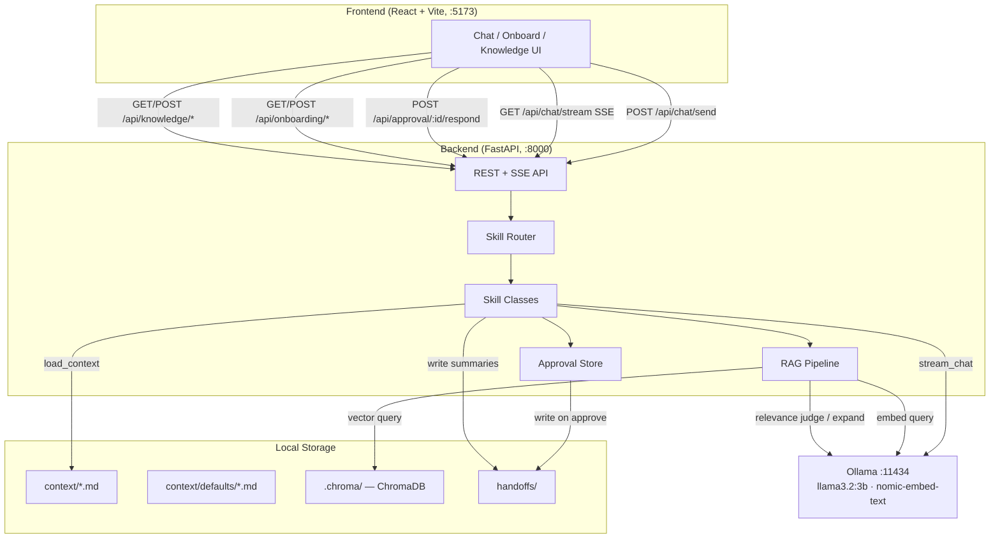
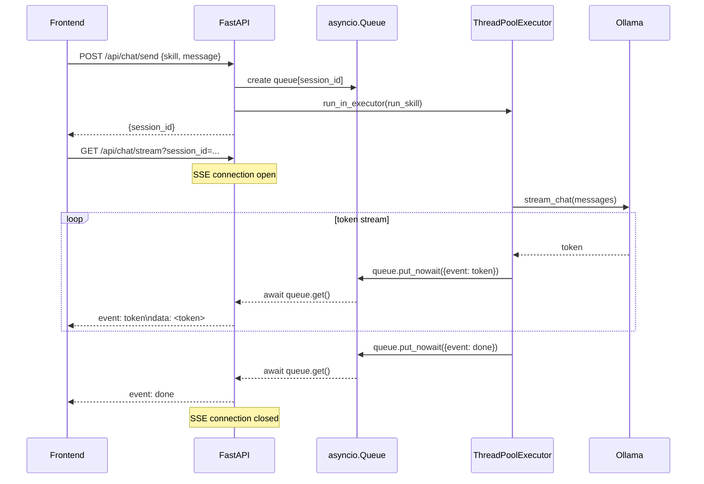
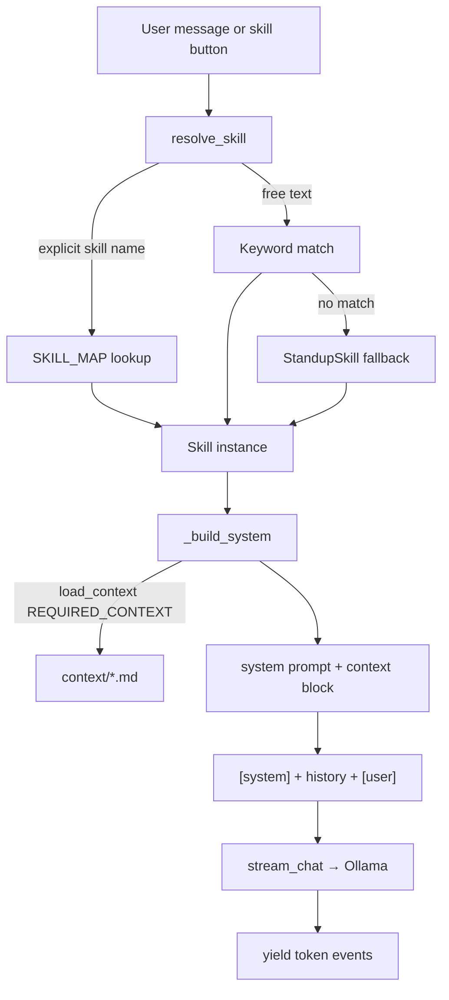
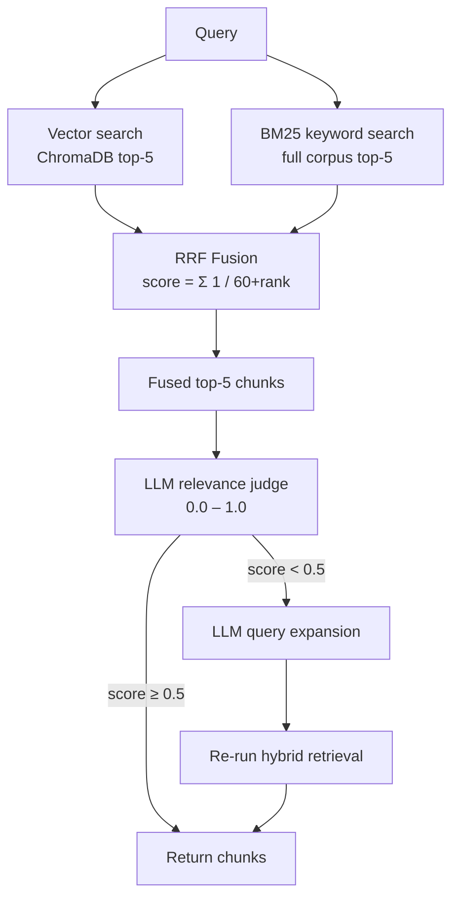
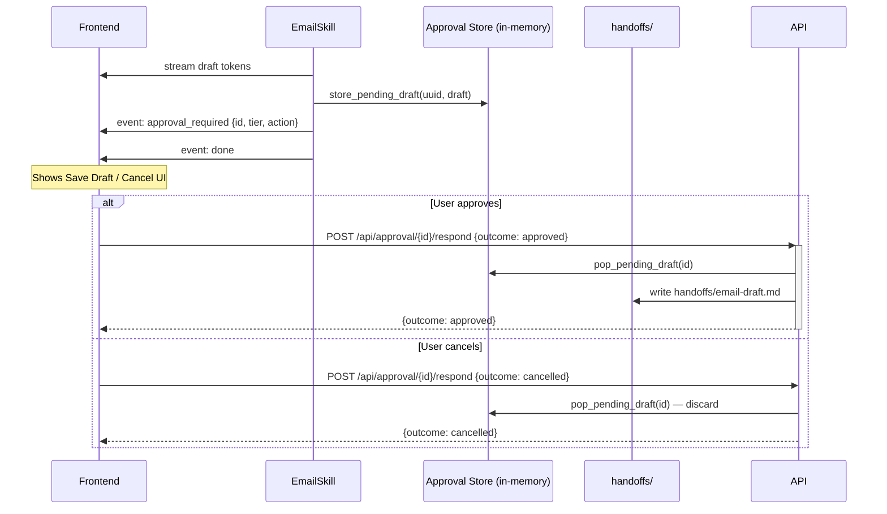
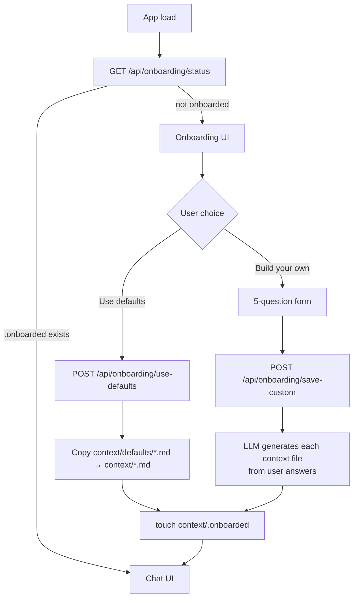

# Design — Local-First Personal Assistant

## Overview

Fully local AI personal assistant. No external API calls at runtime — all inference runs through Ollama on the host. FastAPI backend, React frontend, ChromaDB vector store.

---

## System Architecture



---

## Chat Request Flow

Two-phase design: `POST /send` starts the work and returns immediately; `GET /stream` opens the SSE connection and drains the queue as tokens arrive. This avoids holding an HTTP connection open during inference.



**Thread boundary:** Ollama's Python client is synchronous. Skills run in a `ThreadPoolExecutor` (max 10 workers). Tokens cross the thread boundary via `loop.call_soon_threadsafe(queue.put_nowait, event)`.

**Session state:** Conversation history is stored in-memory (`_sessions: dict[str, list[dict]]`). Not persisted across restarts.

---

## Skill System



Each skill declares `REQUIRED_CONTEXT` — only the files it needs are read from disk. Context is loaded fresh per request (no caching needed at this scale).

| Skill | Context loaded | Special behavior |
|---|---|---|
| Standup | goals, projects, mental-model | — |
| Sync | goals, projects | — |
| Refinement | goals, projects, mental-model | — |
| One-on-One | goals, projects, mental-model | RAG query over handoffs |
| Email | writing-style, email-goals | Tier 2 approval gate |
| Close | goals, projects | Writes handoff file, triggers ingestion |

---

## RAG Pipeline

Used by skills that need long-term memory (1:1 prep, close session). All embedding and inference is local via Ollama.



**Why hybrid:** Vector search handles semantic similarity; BM25 handles exact keyword matches (names, dates, acronyms). RRF fuses both without requiring score normalization.

**Self-correction:** If the relevance judge scores below 0.5, the query is expanded with synonyms and the full retrieval runs again. `meta.corrected` is returned to the caller so the UI (or logs) can surface when this happened.

**Storage:** ChromaDB with a `PersistentClient` backed by SQLite at `.chroma/`. Embeddings are 768-dimensional (`nomic-embed-text`). Chunking: 512 tokens, 64-token overlap.

---

## Approval Gate (Email Skill)

Non-blocking design — the skill does not await the user's decision. The SSE stream ends immediately after emitting `approval_required`; the frontend holds state and makes a separate call when the user responds.



**Trade-off:** In-memory approval store means a server restart between draft generation and user response loses the draft. Acceptable for a local-first single-user app.

---

## Onboarding Flow



`context/defaults/` ships with the repo as portable starter templates. `context/` is the live working directory written by onboarding and read by skills at runtime.

---

## Storage Layout

```
assignment-4/
├── context/
│   ├── defaults/          ← repo-committed starter templates (read-only source)
│   │   ├── writing-style.md
│   │   ├── email-goals.md
│   │   ├── mental-model.md
│   │   ├── goals.md
│   │   └── projects.md
│   ├── writing-style.md   ← live copies (written by onboarding, read by skills)
│   ├── email-goals.md
│   ├── mental-model.md
│   ├── goals.md
│   ├── projects.md
│   └── .onboarded         ← presence = onboarding complete
├── .chroma/               ← ChromaDB SQLite store (gitignored)
└── handoffs/              ← session summaries + email drafts (gitignored)
```

---

## Key Design Decisions

| Decision | Choice | Rationale |
|---|---|---|
| Streaming transport | SSE over WebSockets | Unidirectional stream; simpler; no upgrade handshake |
| Inference thread model | `ThreadPoolExecutor` | Ollama client is sync; executor bridges to async event loop |
| Approval gate | Non-blocking event | Skill stream ends immediately; no server-side await on user |
| Retrieval | Hybrid BM25 + vector + RRF | BM25 covers exact matches; vector covers semantics; RRF fuses without normalization |
| Context loading | Per-request, no cache | File system reads are fast; simplicity > premature optimization |
| Session state | In-memory dict | Local single-user app; persistence not worth the complexity |
| Embedding model | `nomic-embed-text` (768-dim) | Fully local; strong retrieval quality for its size |
